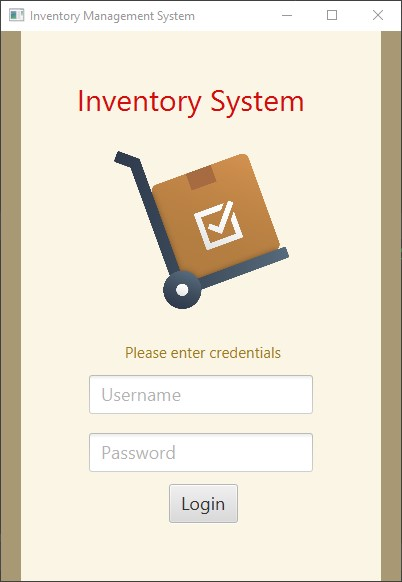
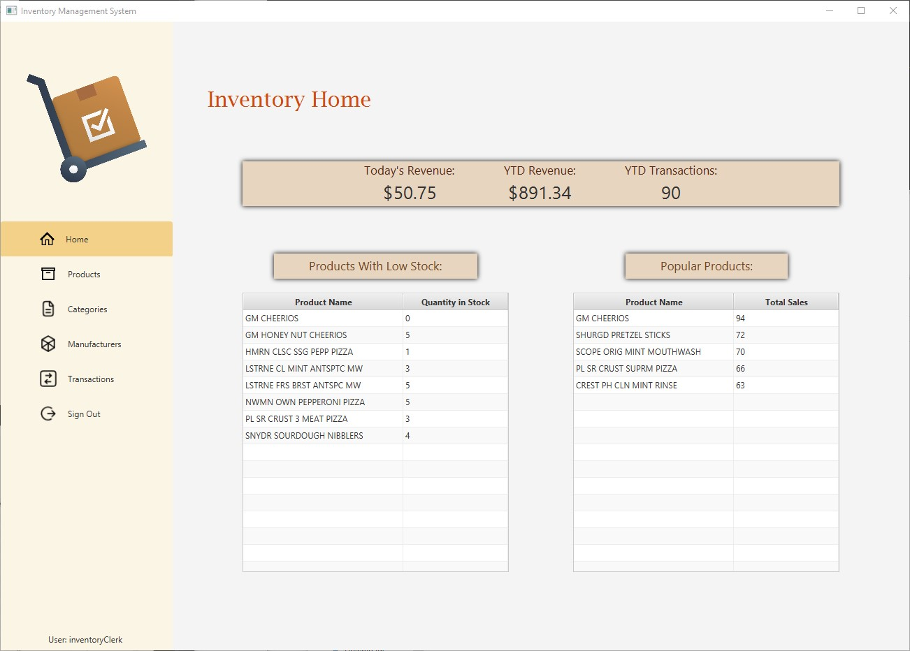
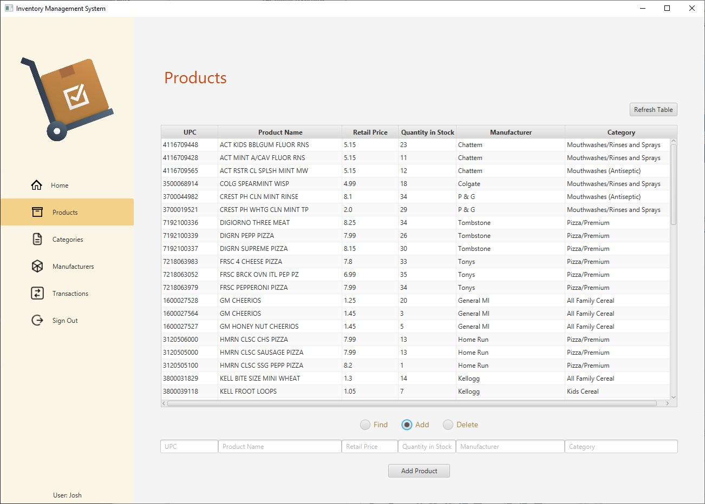
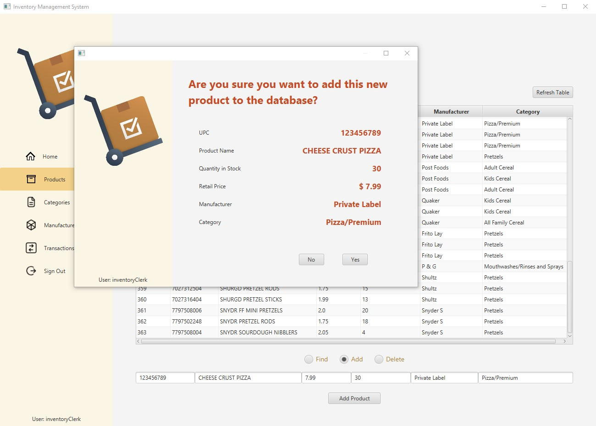
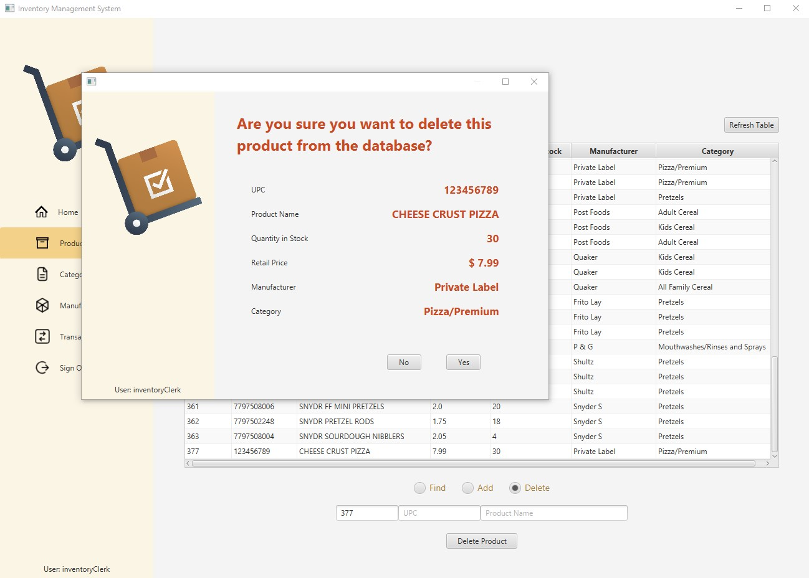
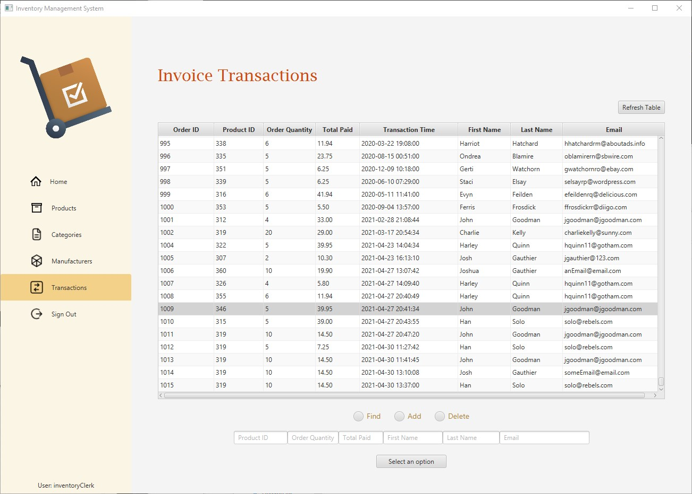
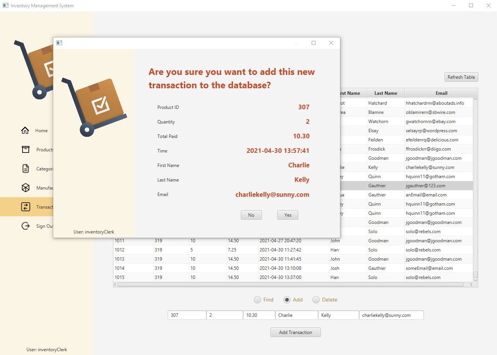

# About the Project

This is a Java application using a MySQL database. It allows a store's 
inventory staff to log in securely with a custom role based access control 
system. Product inventory, customer invoices, and 
product category are the main features of this project that are
currently completed.  

# Depth of Project
This project's authentication system involves a custom java class 
called Authenticator that verifies the user's credentials with 
an XML document. The XML file holds all usernames and passwords. 

Authorization in this project is handled by a java class called 
Authorizer, which is an implementation of a custom role-based access 
control system. Every CRUD action in this application initiates
this class to verify that the user has proper 
permissions. The permission and role information is stored in a 
JSON file, which is accessed only by the Authorizer class.

# YouTube Link to Demo

# Screenshots

  

  

  

  

  

  
